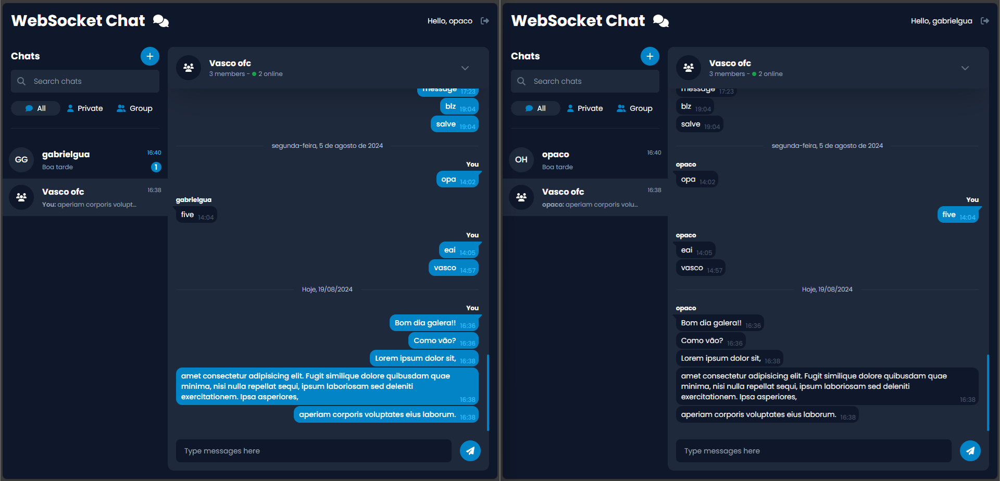

# websocket-chat 💬
This real-time messaging app features instant message sending, and persistent message storage. It supports user presence indicators, chat creation and management (including group chats), and some chat filtering. Users can search for contacts, send messages, and receive notifications, all while enjoying a responsive design with Vue 3, TypeScript, and TailwindCSS. Built with Spring Boot and Java 21, the app ensures real-time updates through WebSockets. The objective of this project was to learn about WebSockets and dive deeper into Vue and TailwindCSS.
# 

# How it works

> The application uses Spring Boot 3, Java 21 and WebSockets for all its backend architecture, and Vue 3 with tailwind CSS for UI and frontend logic.

### Back-End
Here's the functionalities of the backend API:

- [X] __User Authentication via JWT:__ It lets users sign in securely using JSON Web Tokens (JWT).
- [X] __Realtime message sending__: Instantly relays messages to recipients via WebSocket connections and stores them in the database for future retrieval and access.
- [X] __User status monitoring__: Tracks user connections and disconnections in real-time, updating their online/offline status.
- [X] __Notification handling__: Sends notifications for new messages to users, regardless of their online status, and stores them in the database if a user is not currently active.

### Front-End
Here's the functionalities of the front-end UI:

- [X] __Authentication:__ Login and register page.
- [X] __Realtime message sending__: Displays incoming messages in real-time as they arrive.
- [X] __Filter and Search Chats__: Allows users to view conversations by type, such as group chats, private messages, or all chats, for easier organization and navigation.
- [X] __Chat History__: Loads and displays previous messages when a user opens a chat, allowing them to view the conversation history.
- [X] __User status monitoring__: Dynamically updates the UI to reflect the user's online/offline status.
- [X] __Notification handling__: Displays real-time notifications for incoming messages, even if the app is in the background.

## What's Under the Hood?
Here's the technologies used for the implementation:

 * __Spring Data JPA__ for efficient data management.
 * __Spring Security__ with __JWT tokens__ for authentication.
 * __WebSocket__ with __STOMP__ for realtime messaging.
 * __MySql__ for the database.
 * __Flyway__ for the database migrations.
 * __[modelmapper](https://modelmapper.org/)__ for the DTOs.
 * __Vue 3__ with __Typescript__ for the UI and front-end logic.
 * __Tailwind CSS__ for styling the components.

## What’s Next?
Here's some future funcionalities to be implemented: 
- [ ] __User registration:__ Processes user information, verifies it, and stores it in the database to create a new profile and grant access to the app.
- [ ] __User Search__: Allows users to find and select contacts by username to start a new conversation or send messages directly.
- [ ] __Create and Manage Group Chats__: Enables users to start new group chats by selecting participants and naming the group, as well as members.

# How do i run it?

Working on `docker` support.
